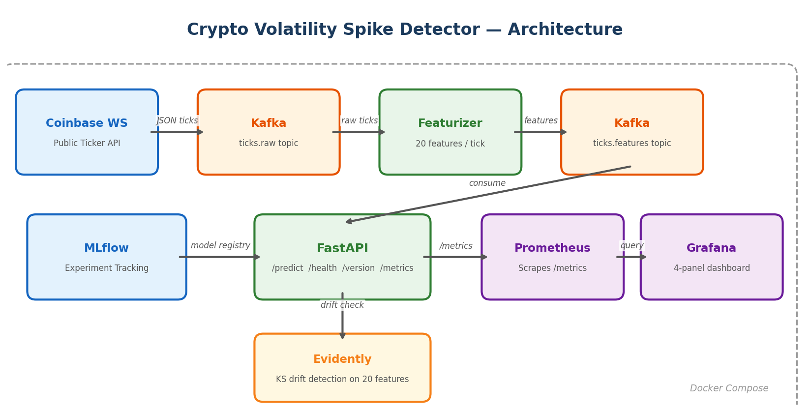

# Crypto Volatility Spike Detector

[](https://github.com/YOUR_ORG/YOUR_REPO/actions/workflows/ci.yml)

Real-time BTC-USD / ETH-USD volatility spike detection — XGBoost + FastAPI + Prometheus + Grafana.

**Team:** Eshita Raj Vegesna, Vaishnavi Athrey Ramesh, Litesha Nagendra, Tejas Goyal

**Demo video:** [YouTube](https://youtu.be/kMenwb_qBR0)

**Team report:** [Crypto_Volatility_Team_Report.pdf](Crypto_Volatility_Team_Report.pdf)

## Quick Start

```bash
cp .env.example .env
docker compose -f docker/compose.yaml up -d --build
# API → localhost:8000 | Grafana → localhost:3000 | Prometheus → localhost:9090
```

## Sample Request

```bash
curl -s -X POST http://localhost:8000/predict \
  -H "Content-Type: application/json" \
  -d '{"rows": [{"ret_mean_10s":0.000001,"ret_std_10s":0.000012,"ret_abs_10s":0.000008,"tick_count_10s":25,"spread_mean_10s":0.000002,"trade_intensity_10s":2.5,"ret_mean_30s":0.000001,"ret_std_30s":0.000015,"ret_abs_30s":0.00001,"tick_count_30s":35,"spread_mean_30s":0.000002,"trade_intensity_30s":3.0,"ret_mean_60s":0.000001,"ret_std_60s":0.00002,"ret_abs_60s":0.000012,"tick_count_60s":45,"spread_mean_60s":0.000002,"trade_intensity_60s":3.5,"spread_bps":0.05,"mid_price":66900.0}]}' | jq .
```

Response: `{"scores": [0.74], "model_variant": "ml", "version": "1.2.0", "ts": "..."}`

## Architecture



## API Endpoints

| Endpoint | Method | Description |
|----------|--------|-------------|
| `/health` | GET | Liveness check + uptime |
| `/predict` | POST | Batch prediction: `{"rows": [...]}` → `{"scores": [...]}` |
| `/predict/legacy` | POST | Single prediction: `{"features": {...}}` → full response |
| `/version` | GET | Model metadata and feature list |
| `/metrics` | GET | Prometheus metrics |

## Rollback

```bash
docker compose -f docker/compose.yaml stop api
MODEL_VARIANT=baseline docker compose -f docker/compose.yaml up -d api
```
